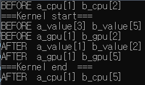

# 0126
### GIT
```
## TIL Ignore File ##

# 확장자가 'a'인 모든 파일을 track하지 않게 할 때
*.a

# 위에서 확장자가 'a'인 모든 파일을 track하지 않도록 했지만, lib.a 파일은 track하도록 하고 싶을 때
!lib.a

# build/ 디렉토리 내의 모든 파일을 track하지 않게 할 때
build/

# doc 디렉토리의 모든 txt 파일은 track하지 않지만, doc 디렉토리 내의 다른 디렉토리의 txt 파일은 track하도록 할 때
doc/*.txt

# doc 디렉토리의 모든 pdf 파일을 track하지 않게 할 때  
doc/**/*.pdf
```
`git rm -r --cached .`  
`git add .`  
`git commit -m "Apply .gitignore"`  
- .gitignore 파일의 사용법은 위와 같다.
- .gitignore 파일을 만든 후 push할 때에는 위와 같은 명령어를 입력해주면 된다.  

`<https://github.com/taemt94/TIL.git>`  
- URL로 링크를 만들 때에는 '< >' 사이에 주소를 입력하면 된다.  

`[TIL repository](https://github.com/taemt94/TIL.git)`  
- '[ ]' 안에는 링크에 사용할 이름을 입력하고, '( )' 안에는 주소를 입력할 경우 링크 이름을 클릭하였을 때 해당 주소로 이동하게 만들 수 있다.

# 0128
### C/C++
`gcc main.c`  
`g++ .\main.cpp`  
- vscode를 사용할 때 터미널에 위와 같이 입력하면 컴파일러가 소스코드를 읽어서 실행코드로 바꿔준다.

`gcc main.c -o main.exe`  
`g++ .\main.cpp -o main.exe`  
- 실행 파일 이름을 -o 옵션으로 원하는 대로 설정할 수 있다.

`gcc -c main.c`  
`g++ -c .\main.cpp`  
- -c 옵션을 주면 컴파일만 하겠다는 뜻으로, 컴파일 후 object 파일을 생성해준다.

`gcc main.o -o exe_from_obj.exe`  
`g++ .\main.o -o exe_from_obj.exe`  
- object 파일만 생성하면 실행 파일은 생성이 안되므로, 컴파일러를 통해 object 파일로 실행 파일을 생성한다.

### CUDA PROGRAMMING
``` c
#include <iostream>
#include "cuda_runtime.h"
#include "device_launch_parameters.h"

__device__ int a_value = 3;
__device__ int b_value = 5;

__global__ void test_exchange(int *a, int *b){
    printf("===Kernel start===\n");
    printf("BEFORE a_value[%d] b_value[%d]\n", a_value, b_value);
    printf("BEFORE a_gpu[%d] b_gpu[%d]\n", *a, *b);
    atomicExch(&a_value, a);
    *b = atomicExch(&b_value, b);
    printf("AFTER a_value[%d] b_value[%d]\n", a_value, b_value);
    printf("AFTER a_gpu[%d] b_gpu[%d]\n", *a, *b);
    printf("===Kernel end  ===\n");
}

int main(void){
    int *a_cpu, *b_cpu;
    a_cpu = new int(1);
    b_cpu = new int(2);
    printf("BEFORE a_cpu[%d] b_cpu[%d]\n", a_cpu, b_cpu);

    int memSize = sizeof(int);
    int *a_gpu, *b_gpu;
    cudaMalloc(&a_gpu, memSize); cudaMalloc(&b_gpu, memSize);
    cudaMemcpy(a_gpu, a_cpu, memSize, cudaMemcpyHostToDevice);
    cudaMemcpy(b_gpu, b_cpu, memSize, cudaMemcpyHostToDevice);

    test_exchange<<<1, 1>>>(a_gpu, b_gpu);

    cudaMemcpy(a_cpu, a_gpu, memSize, cudaMemcpyDeviceToHost);
    cudaMemcpy(b_cpu, b_gpu, memSize, cudaMemcpyDeviceToHost);

    printf("AFTER a_cpu[%d] b_cpu[%d]\n", a_cpu, b_cpu);

    cudaFree(a_gpu); cudaFree(b_gpu);
    delete a_cpu; delete b_cpu; 
}
```


- atomicExch 함수를 테스트해보았다.
- atomicExch 함수는 race condition이 생기지 않도록 하면서 입력한 두개의 값을 교환한다.
- 출력 결과를 보면, a_value 값은 3에서 1로 바뀌었지만, a_gpu 값은 그대로 1인 것을 알 수 있다.
- 이는 atomicExch 함수가 첫번째 인자의 값만 두번째 인자의 값으로 바꾸기 때문이다.
- 또한 atomicExch 함수는 첫번째 인자의 바꾸기 전의 값을 리턴한다.
- 따라서 두 변수의 값을 말그대로 교환하고 싶으면 `*b = atomicExch(&b_value, b);` 와 같이 바꿀 값을 첫번째 인자에 넣어 그 값을 리턴받는 형태로 코드를 작성해야 한다.
- 이와 같이 작성하였을 때 b_gpu의 경우 2에서 5로 b_value와 값이 교환된 것을 알 수 있다.

# 0129
### PYTHON
`pip show virtualenv`  
- pip로 설치한 모듈의 세부정보를 확인할 수 있는 명령어.  
- virtualenv는 파이썬 가상 환경을 만드는 프로그램이라고 한다.  

`python -m virtualenv tf2env`  
- 윈도우 환경에서 가상환경을 생성할 때에는 다음과 같이 입력해야 한다.  

`source tf2env/bin/activate`  
`call tf2env/scripts/activate`  
- 리눅스에서 가상환경을 활성화할 때는 source 명령어를 사용하면 되는 듯 하다.
- 그러나 윈도우 상에서 가상환경을 활성화할 때에는 call 명령어를 사용해야 한다.  