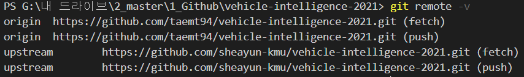

# 0103
### github
- 로컬 저장소에서 폴더 생성하여 생성한 폴더에 파일을 작성하여 commit/push 하면 원격 저장소에도 동일하게 폴더까지 생성된다.

`git clone git@github.com:taemt94/welcome.git .`  
- 해당 주소의 저장소를 현재 디렉토리로 가져온다. 여기서 ‘.’이 현재 디렉토리를 의미한다. '.'을 입력하지 않으면 레포지토리에 해당하는 폴더가 생성된다.  
- git clone은 클라이언트 상에 아무것도 없을 때(로컬 폴더가 빈 폴더일 때?) 서버의 프로젝트를 내려받는 명령어라고 한다.

`git diff`  
- 파일에서 수정한 내용을 보여준다.

`git add file3.txt`  
- File3.txt를 commit할 것임을 git에게 알려주는 명령어가 add.

`git add .`  
- 전체 파일 add.

`git commit –m “version5”`  
- 지금 수정된 내용을 “version5”라는 이름의 버전으로 만들라는 뜻.

`git log`  
- Commit 기록을 보여준다.

`git push`  
- git commit 까지만 하면 아직 로컬 저장소와 원격 저장소가 동기화되지 않은 상태이므로 로컬 저장소를 업로드해서 두 저장소의 파일 버전이 동일하게끔 동기화를 시켜줄 때 사용하는 명령어.

`git status`  
- 어느 파일이 수정되었는지를 알 수 있다.

`git remote –v`  
- 해당 디렉토리가 어느 레포지토리에 해당하는지 알 수 있다.

`git pull`  
- 다른 사람이 pull request를 통해서 코드를 업데이트했거나, github 상에서 commit을 했을 때 해당 업데이트를 로컬 저장소로 내려받는 명령어이다.  

`git init`  
- 처음 레포지토리를 생성할 때 해당 폴더로 들어가서 git init을 치면, .git 파일이 생성된다. git 파일에 모든 버전 정보가 저장된다.
- github 상에서 commit을 한 후 pull을 하지 않은채 로컬 저장소에서 commit을 하면 에러가 발생한다. 로컬 저장소에서만 파일을 관리하는 것이 좋을 듯 하다.
---
### git
- GIT은 하나의 version control system 이다. 변경사항을 관리하는 시스템. 추가적으로 백업, 복원, 협업 등을 할 수 있다.
- git bash는 리눅스 유닉스 계열의 명령어를 통해 윈도우를 제어할 수 있는 프로그램이다. 깃을 설치하면 같이 설치된다.
- 필요에 의해 작업이 분기되는 현상을 branch를 만든다고 말한다.
- 기존의 매우 무겁고 불편하고 느렸던 브랜치를 깃에서 매우 편리하게 쓸만하게 만들었다.
- 깃은 모든 것을 브랜치라는 개념으로 내부적으로도 다루고 있기 때문에 브랜치를 꼭 알고 있어야 한다.
---
# 0116
### github
`git remote add origin 'repository dir'`  
- origin이라는 이름으로 원격 저장소를 로컬 저장소에서 관리하게 해주는 명령어이다.  
- origin은 예시이고, 필요에 따라 원하는 이름을 설정하면 된다.  

`git remote remove origin`  
- origin이라는 이름으로 관리하는 원격 저장소를 제거한다.  
- 깃허브를 쓰다가 commit이 꼬여서 commit을 해도 push가 안되는 경우가 몇 번 있었다.
- 이럴 때 연동시켜놓은 저장소를 제거한 후 다시 remote add 해야 하기 때문에 remove 명령어를 사용한다.

# 0122
### GIT
`git reset HEAD [file name]`  
- git add 취소 명령어.
- file name을 입력하지 않으면 파일 전체를 취소한다.

`git reset --soft HEAD^`  
- git commit 취소 명령어.

# 0126
### GIT
```
## TIL Ignore File ##

# 확장자가 'a'인 모든 파일을 track하지 않게 할 때
*.a

# 위에서 확장자가 'a'인 모든 파일을 track하지 않도록 했지만, lib.a 파일은 track하도록 하고 싶을 때
!lib.a

# build/ 디렉토리 내의 모든 파일을 track하지 않게 할 때
build/

# doc 디렉토리의 모든 txt 파일은 track하지 않지만, doc 디렉토리 내의 다른 디렉토리의 txt 파일은 track하도록 할 때
doc/*.txt

# doc 디렉토리의 모든 pdf 파일을 track하지 않게 할 때  
doc/**/*.pdf
```
`git rm -r --cached .`  
`git add .`  
`git commit -m "Apply .gitignore"`  
- .gitignore 파일의 사용법은 위와 같다.
- .gitignore 파일을 만든 후 push할 때에는 위와 같은 명령어를 입력해주면 된다.  

# 2021/03/25
### Fork한 레포에 원본 레포에서 추가된 내용 동기화하기
- 과제를 할 때 과제 레포를 fork 했는데 원본 레포에 교수님께서 매주 과제를 추가하셔서 추가된 과제를 내가 fork한 레포에도 동기화를 시켜주어야 하였다.
- 이럴 때는 원본 레포를 Upstream(레포 이름) 레포로 추가해주면 된다고 한다.  
1. `git remote add upstream https://github.com/[Original Owner Username]/[Original Repository].git`  
   - 위와 같이 입력하고서 레포를 확인하면 아래와 같이 upstream 레포가 추가된 것을 알 수 있다.  
2. `git remote -v`   
   
    >    
3. `git fetch upstream`
   - Upstream 레포를 만든 후, 해당 레포를 fetch하여 원본 레포에 추가된 내용을 가져온다.
   - fetch라는 단어가 잘 와닿지 않아서 사전적 정의를 찾아보니 `(어디를 가서) 가지고[데리고/불러] 오다`라는 뜻이라는 것을 보아 해당 레포의 추가된 내용을 가지고 온다고 이해하면 될 것 같다.
   - 여기서 upstream 레포를 fetch하게 되면, origin/master 브랜치가 아닌 upstream/master 브랜치에 원본 레포의 커밋들이 저장된다는 것을 알고 있어야 한다.
4. `git checkout master`
   - 그리고 나서 checkout 명령어를 통해 현재 fork한 레포에 위치해있는지 확인한다.
   - Checkout 명령어는 내가 사용할 브랜치를 지정하는 명령어라고 한다.
5. `git merge upstream/master`
   - upstream/master에 추가된 내용과 내 local master 브랜치를 합친다.
   - 이렇게 하면 내가 fork할 레포에 내가 추가한 내용은 그대로 인채 원본 레포에 추가된 내용을 가져올 수 있다.
   - 그러나 충돌이 있을 수 있는 내용을 추가했을 경우 merge를 하게 되면 추가한 내용을 잃을 수 있으니 주의해야 한다.
6. `git push origin master`
   - 마지막으로 원본 레포와 merge 한 후, 깃허브 상의 레포에도 추가된 내용을 업데이트해주기 위해 push를 한다.
   - `git clone`으로 가져온 레포의 경우 기존과 같이 `git push`만 입력하면 된다.

# 2021/04/06
### Git repositopy 연결 끊기
`git remote remove origin`
- 위의 명령어를 입력하면 로컬 저장소의 .git 파일이 삭제되어 원격 저장소와의 연결이 끊어진다.

# 2021/04/20
### git repository 강제 pull 하기
- 보통 작업은 내 local 컴퓨터에서 진행하고 나서 서버 컴퓨터에서는 코드만 git pull하여 사용한다.
- 그런데 가끔 서버에서 테스트를 하는 등의 작업으로 코드가 local 컴퓨터의 코드와 약간 달라 에러가 발생하여 git pull이 안될 때가 있다.
- 이럴 때는 아래와 같이 모든 파일들을 덮어씌우는 형태로 강제 git pull 하는 방법을 사용하면 된다.
  ```
  $ git fetch -all
  $ git reset --hard origin/main
  $ git pull origin main
  ```
# 2021/04/22
### commit message 변경하기
- commit message를 잘못 적은 경우 아래와 같은 명령어로 message를 변경할 수 있다.
  ```
  $ git commit --amend [file directory] -m "Modified commit message"
  ```