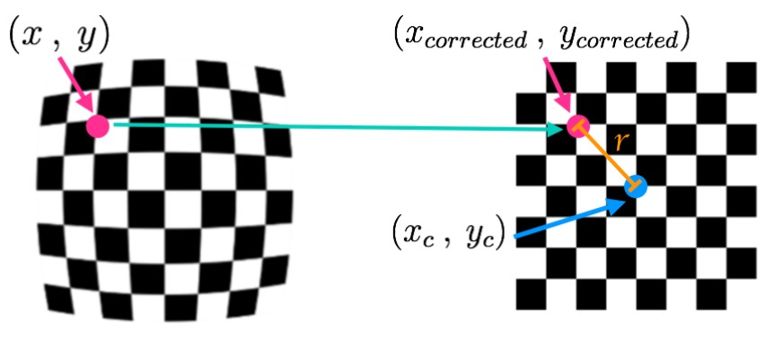

#### 2022/01/18
## Lesson 3: Sensor and Camera Calibration
### Intro to the Camera Sensor
- Understand the data = Understand the sensor
- Self driving cars have multiple cameras
- Raw data needs to be processed before being used by a ML algorithm
- This lesson will be organized as follow:
  - The camera sensor and its distortion effect
  - The camera pinhole model
  - Camera calibration
  - RGB and other color systems
  - Image manipulation in Python
- Introducing Cezanne
  - Expert in Computer Vision
  - Masters in Electrical Engineering from Stanford University
  - Former Researcher in Genomics and Biomedical Imaging
  - You'll learn about:
    - Distortion correction
    - Camera pinhole model
    - How to use OpenCV to calibrate cameras

### Big Picture
- Camera Usages in Self Driving Car
  - **High resolution sensor**
  - Colors / Optical character recognition
  - **Depth reconstruction** with stereo cameras
  - Cost / space efficient
- Camera Limitations
  - Sensitive to **weather**
  - Information needs to be **extracted** with an algorithm
  - Not great for **depth estimation**
- Cameras are optical instruments capturing the **light intensity** on a digital image. The most important characteristics of a camera for a ML engineer are the following:

- **Resolution**: Number of pixels the image captured by the camera is made of (usually described in mega pixels).
- **Aperture**: size of the opening where the light enters the camera. Controls the amount of light received by the sensor.
- **Shutter speed**: duration that the sensor is exposed to the light. Also controls the amount of light by the sensor.
- **Focal length / field of view**: this parameter controls the angle of view of the image.

### Distortion Correction
#### Distortion
- Image distortion occurs when a camera looks at 3D objects in the real world and transforms them into a 2D image; this transformation isn’t perfect. Distortion actually changes what the shape and size of these 3D objects appear to be. So, the first step in analyzing camera images, is to undo this distortion so that you can get correct and useful information out of them.
- Helpful Quiz : Why is it important to correct for image distortion?
  - Distortion can change the apparent size of an object in an image.
  - Distortion can change the apparent shape of an object in an image.
  - Distortion can cause an object's appearance to change depending on where it is in the field of view.
  - Distortion can make objects appear closer or farther away than they actually are.

#### 2021/01/19
### Pinhole Camera Model
#### Types of Distortion
- Real cameras use curved lenses to form an image, and light rays often bend a little too much or too little at the edges of these lenses. This creates an effect that distorts the edges of images, so that lines or objects appear more or less curved than they actually are. This is called **radial distortion**, and it’s the most common type of distortion.
- Another type of distortion, is **tangential distortion**. This occurs when a camera’s lens is not aligned perfectly parallel to the imaging plane, where the camera film or sensor is. This makes an image look tilted so that some objects appear farther away or closer than they actually are.

#### Distortion Coefficients and Correction
- There are three coefficients needed to correct for **radial distortion**: **k1**, **k2**, and **k3**. To correct the appearance of radially distorted points in an image, one can use a correction formula.
- In the following equations, ($x$, $y$) is a point in a distorted image. To undistort these points, OpenCV calculates $r$, which is the known distance between a point in an undistorted (corrected) image ($x_{corrected}$, $y_{corrected}$) and the center of the image distortion, which is often the center of that image ($x_c$, $y_c$). This center point ($x_c$, $y_c$) is sometimes referred to as the distortion center. These points are pictured below.
- Note: The distortion coefficient **k3** is required to accurately reflect major radial distortion (like in wide angle lenses). However, for minor radial distortion, which most regular camera lenses have, k3 has a value close to or equal to zero and is negligible. So, in OpenCV, you can choose to ignore this coefficient; this is why it appears at the end of the distortion values array: **[k1, k2, p1, p2, k3]**. In this course, we will use it in all calibration calculations so that our calculations apply to a wider variety of lenses (wider, like wide angle, haha) and can correct for both minor and major radial distortion.

Points in a distorted and undistorted (corrected) image. The point (x, y) is a single point in a distorted image and (x_corrected, y_corrected) is where that point will appear in the undistorted (corrected) image.

  $x_{distorted} = x_{ideal}(1 + k_1r^2+k_2r^4+k_3r^6)$  
  $y_{distorted} = y_{ideal}(1 + k_1r^2+k_2r^4+k_3r^6)$  
  Radial distortion correction.
- There are two more coefficients that account for **tangential distortion**: **p1** and **p2**, and this distortion can be corrected using a different correction formula.  
  $x_{corrected} = x + [2p_1xy + p_2(r^2 + 2x^2)]$  
  $y_{corrected} = y + [p_1(r^2 + 2y^2) + 2p_2xy]$  
  Tangential distortion correction.
- Helpful Quiz : What is the fundamental difference between images formed with a pinhole camera and those formed using lenses?
  - Pinhole camera images are free from distortion, but lenses tend to introduce image distortion.