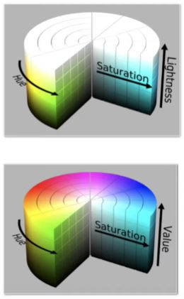

#### 2022/01/18
## Lesson 3: Sensor and Camera Calibration
### Intro to the Camera Sensor
- Understand the data = Understand the sensor
- Self driving cars have multiple cameras
- Raw data needs to be processed before being used by a ML algorithm
- This lesson will be organized as follow:
  - The camera sensor and its distortion effect
  - The camera pinhole model
  - Camera calibration
  - RGB and other color systems
  - Image manipulation in Python
- Introducing Cezanne
  - Expert in Computer Vision
  - Masters in Electrical Engineering from Stanford University
  - Former Researcher in Genomics and Biomedical Imaging
  - You'll learn about:
    - Distortion correction
    - Camera pinhole model
    - How to use OpenCV to calibrate cameras

### Big Picture
- Camera Usages in Self Driving Car
  - **High resolution sensor**
  - Colors / Optical character recognition
  - **Depth reconstruction** with stereo cameras
  - Cost / space efficient
- Camera Limitations
  - Sensitive to **weather**
  - Information needs to be **extracted** with an algorithm
  - Not great for **depth estimation**
- Cameras are optical instruments capturing the **light intensity** on a digital image. The most important characteristics of a camera for a ML engineer are the following:

- **Resolution**: Number of pixels the image captured by the camera is made of (usually described in mega pixels).
- **Aperture**: size of the opening where the light enters the camera. Controls the amount of light received by the sensor.
- **Shutter speed**: duration that the sensor is exposed to the light. Also controls the amount of light by the sensor.
- **Focal length / field of view**: this parameter controls the angle of view of the image.

### Distortion Correction
#### Distortion
- Image distortion occurs when a camera looks at 3D objects in the real world and transforms them into a 2D image; this transformation isn’t perfect. Distortion actually changes what the shape and size of these 3D objects appear to be. So, the first step in analyzing camera images, is to undo this distortion so that you can get correct and useful information out of them.
- Helpful Quiz : Why is it important to correct for image distortion?
  - Distortion can change the apparent size of an object in an image.
  - Distortion can change the apparent shape of an object in an image.
  - Distortion can cause an object's appearance to change depending on where it is in the field of view.
  - Distortion can make objects appear closer or farther away than they actually are.

#### 2021/01/19
### Pinhole Camera Model
#### Types of Distortion
- Real cameras use curved lenses to form an image, and light rays often bend a little too much or too little at the edges of these lenses. This creates an effect that distorts the edges of images, so that lines or objects appear more or less curved than they actually are. This is called **radial distortion**, and it’s the most common type of distortion.
- Another type of distortion, is **tangential distortion**. This occurs when a camera’s lens is not aligned perfectly parallel to the imaging plane, where the camera film or sensor is. This makes an image look tilted so that some objects appear farther away or closer than they actually are.

#### Distortion Coefficients and Correction
- There are three coefficients needed to correct for **radial distortion**: **k1**, **k2**, and **k3**. To correct the appearance of radially distorted points in an image, one can use a correction formula.
- In the following equations, ($x$, $y$) is a point in a distorted image. To undistort these points, OpenCV calculates $r$, which is the known distance between a point in an undistorted (corrected) image ($x_{corrected}$, $y_{corrected}$) and the center of the image distortion, which is often the center of that image ($x_c$, $y_c$). This center point ($x_c$, $y_c$) is sometimes referred to as the distortion center. These points are pictured below.
- Note: The distortion coefficient **k3** is required to accurately reflect major radial distortion (like in wide angle lenses). However, for minor radial distortion, which most regular camera lenses have, k3 has a value close to or equal to zero and is negligible. So, in OpenCV, you can choose to ignore this coefficient; this is why it appears at the end of the distortion values array: **[k1, k2, p1, p2, k3]**. In this course, we will use it in all calibration calculations so that our calculations apply to a wider variety of lenses (wider, like wide angle, haha) and can correct for both minor and major radial distortion.

Points in a distorted and undistorted (corrected) image. The point (x, y) is a single point in a distorted image and (x_corrected, y_corrected) is where that point will appear in the undistorted (corrected) image.

  $x_{distorted} = x_{ideal}(1 + k_1r^2+k_2r^4+k_3r^6)$  
  $y_{distorted} = y_{ideal}(1 + k_1r^2+k_2r^4+k_3r^6)$  
  Radial distortion correction.
- There are two more coefficients that account for **tangential distortion**: **p1** and **p2**, and this distortion can be corrected using a different correction formula.  
  $x_{corrected} = x + [2p_1xy + p_2(r^2 + 2x^2)]$  
  $y_{corrected} = y + [p_1(r^2 + 2y^2) + 2p_2xy]$  
  Tangential distortion correction.
- Helpful Quiz : What is the fundamental difference between images formed with a pinhole camera and those formed using lenses?
  - Pinhole camera images are free from distortion, but lenses tend to introduce image distortion.

#### 2021/01/20
### Camera Calibration
#### Note Regarding Corner Coordinates
- Since the origin corner is (0,0,0) the final corner is (6,4,0) relative to this corner rather than (7,5,0).
#### Examples of Useful Code
- Converting an image, imported by cv2 or the glob API, to grayscale:
  ``` python
  gray = cv2.cvtColor(img,cv2.COLOR_BGR2GRAY)
  ```
  - Note: If you are reading in an image using mpimg.imread() this will read in an RGB image and you should convert to grayscale using cv2.COLOR_RGB2GRAY, but if you are using cv2.imread() or the glob API, as happens in this video example, this will read in a BGR image and you should convert to grayscale using cv2.COLOR_BGR2GRAY. We'll learn more about color conversions later on in this lesson, but please keep this in mind as you write your own code and look at code examples.
- Finding chessboard corners (for an 8x6 board):
  ``` python
  ret, corners = cv2.findChessboardCorners(gray, (8,6), None)
  ```
- Drawing detected corners on an image:
  ``` python
  img = cv2.drawChessboardCorners(img, (8,6), corners, ret)
  ```
- Camera calibration, given object points, image points, and the shape of the grayscale image:
  ``` python
  ret, mtx, dist, rvecs, tvecs = cv2.calibrateCamera(objpoints, imgpoints, gray.shape[::-1], None, None)
  ```
- Undistorting a test image:
  ``` python
  dst = cv2.undistort(img, mtx, dist, None, mtx)
  ```
#### A note on image shape
- The shape of the image, which is passed into the calibrateCamera function, is just the height and width of the image. One way to retrieve these values is by retrieving them from the grayscale image shape array gray.shape[::-1]. This returns the image width and height in pixel values like (1280, 960).
- Another way to retrieve the image shape, is to get them directly from the color image by retrieving the first two values in the color image shape array using img.shape[1::-1]. This code snippet asks for just the first two values in the shape array, and reverses them. Note that in our case we are working with a greyscale image, so we only have 2 dimensions (color images have three, height, width, and depth), so this is not necessary.
- It's important to use an entire grayscale image shape or the first two values of a color image shape. This is because the entire shape of a color image will include a third value -- the number of color channels -- in addition to the height and width of the image. For example the shape array of a color image might be (960, 1280, 3), which are the pixel height and width of an image (960, 1280) and a third value (3) that represents the three color channels in the color image which you'll learn more about later, and if you try to pass these three values into the calibrateCamera function, you'll get an error.

#### 2021/01/21
### Image Manipulation
- Grayscale images are single channel images that only contain information about the intensity of the light.
- Color models are mathematical models used to describe digital images. The **Red, Green, Blue (RGB)** color model describes images using three channels. Each pixel in this model is described by a triplet of values, usually 8-bit integers. This is the most common color model used in ML. **HLS/HSV** are also very popular color models. They take a different approach than the RGB model by encoding the color with a single value, the hue. The other two values characterize the darkness / colorfulness of the image.
  
#### Grayscale
- Color spaces: mathematical model describing colors using tuples
  - RGB
  - HSV / HLS
- **Grayscale** images: only carry information about the intensity of the light

#### RGB
- **RGB**: each pixel is a tuple of three values, most of the time 8 bits integer
- A RGB image is made of three channels, one for each color of the model
- We can use the channels to threshold the image based on colors
- Limitations:
  - Non linear color model
  - Hard to determine specific colors

#### HLS / HSV
- **HLS**: Hue / Lightness / Saturation
- **HSV**: Hue / Saturation / Value
  - **Hue**: Color encoding, angle [0, 360]
  - **Lightness / Value**: relative lightness or darkness of a color [0, 1]
  - **Saturation**: measurement of colorfulness [0, 1]
  - **Color thresholding** made **easier** because a single value encodes the color  
  
  


#### 2022/01/24
### Pixel Level Transformation
- **Pillow** is a python imaging library. Using Pillow, we can easily load images, convert them from one color model to another and perform diverse pixel level transformation, such as color thresholding.
- **Color thresholding** consists of isolating a range of color from a digital image. It can be done using different color models, but the HSV/HLS color models are particularly well suited for this task.

### Image Enhancement and Filtering
- Images in ML dataset reflect real life conditions and therefore may need to be improved upon or modified. Pillow provides a very useful module, **ImageEnhance**, to perform pixel level transformations on images, such as contrast changes. **Moreover, ML engineers often want to add some noise to the images in the dataset to reduce overfitting. ImageEnhance provides simple ways of doing so.**

### Geometric Transformation
- In addition to pixel level transformation, Pillow also provides ways to perform **geometric transformations**, such as rotation, resizing or translation. In particular, we can use Pillow to perform **affine transformation** (a geometric transformation where lines are preserved) using a transformation matrix.

### Lesson Conclusion
- In this lesson, we learned about:

  - **The camera sensor and its distortion effect.** A camera captures light to a digital sensor but the raw images are distorted.
  - **The camera pinhole model**: a simplified physical model of cameras.
  - **Camera calibration** and how to use the Python library OpenCV to calibrate a camera using checkerboard images.
  - **RGB and other color systems**. We discovered the RGB, HLS and HSV color systems and learned about the strength and weaknesses of each one.
  - **Image manipulation in Python** and how to leverage Pillow to perform pixel-level and geometric transformations of digital images.

### Glossary
- **Aperture**: size of the opening where the light enters the camera. Controls the amount of light received by the sensor.
- **Calibration**: process of estimating a camera's parameters.
- **Focal length** / **field of view**: this parameter controls the angle of view of the image.
- **Grayscale images**: single channel images that only contain information about the intensity of the light.
- **HLS/HSV**: color model encoding the color with a single value, the hue. The other two values characterize the darkness / colorfulness of the image.
- **Pinhole camera model**: simplified physical model of a camera.
- **Resolution**: Number of pixels the image captured by the camera is made of (usually described in mega pixels).
- **RGB**: color model using (red, green, blue) triplet to describe a pixel.
- **Shutter speed**: duration that the sensor is exposed to the light.