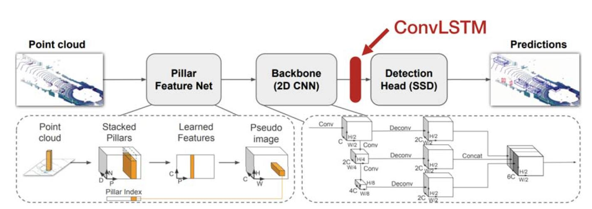

# PointPillars : Fast Encoders for Object Detection From Point Clouds
### Authors : Alex H. Lang, et al.
### Year : 2019
### Journal : CVPR
### Citation : 594(2021.08. 기준)

## Abstract
- In this paper we consider the problem of encoding a point
cloud into a format appropriate for a downstream detection
pipeline.

- PointPillars, a novel encoder
which utilizes PointNets to learn a representation of
point clouds organized in vertical columns (pillars).
- While the encoded features can be used with any standard 2D convolutional
detection architecture, we further propose a lean downstream network.

## 1. Introduction
- To
detect and track moving objects, autonomous vehicles rely on several sensors
out of which the lidar is arguably the most important.
- Traditionally, a lidar robotics pipeline interprets
such point clouds as object detections through a bottomup
pipeline involving background subtraction, followed by
spatiotemporal clustering and classification [12, 9].
- Some early works focus on either using 3D convolutions [3] or a projection of the point cloud into the image
[14].
- Recent methods tend to view the lidar point cloud
from a bird’s eye view [2, 11, 31, 30].
- However, the bird’s eye view tends to be extremely
sparse which makes direct application of convolutional
neural networks impractical and inefficient.

- Building on the PointNet design developed by Qi et al. [22],
VoxelNet [31] was one of the first methods to truly do end-to-
end learning in this domain.
- VoxelNet divides the space
into voxels, applies a PointNet to each voxel, followed by
a 3D convolutional middle layer to consolidate the vertical
axis, after which a 2D convolutional detection architecture
is applied.
- However, VoxelNet's inference time, at 4:4 Hz, is too slow to deploy in real time.
- Recently SECOND [28] improved the inference speed of
VoxelNet but the 3D convolutions remain a bottleneck.
- In this work, we propose PointPillars: a method for object
detection in 3D that enables end-to-end learning with
only 2D convolutional layers.
- PointPillars uses a novel encoder
that learn features on pillars (vertical columns) of the
point cloud to predict 3D oriented boxes for objects.
- Advantages
  1. By learning
features instead of relying on fixed encoders, PointPillars
can leverage the full information represented by the point
cloud.
  2. By operating on pillars instead of voxels, there is no need to tune the binning of the vertical direction
by hand.
  3. Pillars are highly efficient because all
key operations can be formulated as 2D convolutions which
are extremely efficient to compute on a GPU.
  4. PointPillars requires no
hand-tuning to use different point cloud configurations.
- We evaluated our PointPillars network on the public
KITTI detection challenges which require detection of cars,
pedestrians, and cyclists in either the bird’s eye view (BEV)
or 3D [5].
- PointPillars dominates the current state of the
art including methods that use lidar and images.

### 1.1. Related Work
#### 1.1.1 Object detection using CNNs
- The
series of papers that followed [24, 7] advocate a two-stage
approach to Object detection problem in images.

- In a single-stage architecture a
dense set of anchor boxes is regressed and classified in a
single stage into a set of predictions providing a fast and
simple architecture.
- In this work, we use a single
stage method.

#### 1.1.2 Object detection in lidar point clouds
- Object detection in point clouds is an intrinsically three dimensional
problem.

- In the most common paradigm, the
point cloud is organized in voxels and the set of voxels in
each vertical column is encoded into a fixed-length, handcrafted,
feature encoding to form a pseudo-image which can
be processed by a standard image detection architecture.  
 -> MV3D, AVOD, PIXOR, Complex YOLO
- In their seminal work Qi et al. [22, 23] proposed a simple
architecture, PointNet, for learning from unordered point
sets, which offered a path to full end-to-end learning.
- VoxelNet
[31] is one of the first methods to deploy PointNets
for object detection in lidar point clouds.
- But like the earlier work that relied on 3D convolutions, VoxelNet is slow, requiring 225ms inference time (4:4 Hz) for a
single point cloud.
- Frustum PointNet [21], uses PointNets to segment and classify the point
cloud in a frustum generated from projecting a detection on
an image into 3D.
- But
its multi-stage design makes end-to-end learning impractical.
- Very recently SECOND [28] offered a series of improvements
to VoxelNet resulting in stronger performance
and a much improved speed of 20 Hz.
- However, they were
unable to remove the expensive 3D convolutional layers.

### 1.2. Contributions
1. We propose a novel point cloud encoder and network,
PointPillars, that operates on the point cloud to enable
end-to-end training of a 3D object detection network.
2. We show how all computations on pillars can be posed
as dense 2D convolutions which enables inference at
62 Hz; a factor of 2-4 times faster than other methods.
3. We conduct experiments on the KITTI dataset and
demonstrate state of the art results on cars, pedestrians,
and cyclists on both BEV and 3D benchmarks.
4. We conduct experiments on the KITTI dataset and
demonstrate state of the art results on cars, pedestrians,
and cyclists on both BEV and 3D benchmarks.

## 2. PointPillars Network
- PointPillars accepts point clouds as input and estimates
oriented 3D boxes for cars, pedestrians and cyclists. 
- Three main stages
  1. Feature encoder
network that converts a point cloud to a sparse pseudo-image. 
  2. A 2D convolutional backbone to process the
pseudo-image into high-level representation.
  3. A detection
head that detects and regresses 3D boxes. 

### 2.1. Pointcloud to Pseudo-Image
- To apply a 2D convolutional architecture, we first convert
the point cloud to a pseudo-image.

- We denote by _l_ a point in a point cloud with coordinates
_x, y, z_ and reflectance _r_.
- As a first step the point cloud
is discretized into an evenly spaced grid in the x-y plane,
creating a set of pillars _P_
with _|P|
= B_.
- The points in each pillar are then augmented
with _xc, yc, zc, xp_ and _yp_ where the _c_ subscript denotes
distance to the arithmetic mean of all points in the pillar and
the _p_ subscript denotes the offset from the pillar _x, y_ center.
- The augmented lidar point _l_ is now D = 9 dimensional.
- The set of pillars will be mostly empty due to sparsity
of the point cloud, and the non-empty pillars will in general
have few points in them.
- This sparsity is exploited by imposing a
limit both on the number of non-empty pillars per sample
(_P_) and on the number of points per pillar (_N_) to create a
dense tensor of size (_D, P, N_).
- If a sample or pillar holds
too much data to fit in this tensor the data is randomly sampled. Conversely, if a sample or pillar has too little data to populate the tensor, zero padding is applied.
- Next, we use a simplified version of PointNet where, for each point, a linear layer is applied followed by Batch-Norm [10] and ReLU [19] to generate a (_C, P, N_) sized tensor.
- This is followed by a max operation over the channels to create an output tensor of size (_C, P_).
- Note that the linear layer can be formulated as a 1x1 convolution across the tensor resulting in very efficient computation.
- Once encoded, the features are scattered back to the original pillar locations to create a pseudo-image of size (_C, H, W_) where _H_ and _W_ indicate the height and width of the canvas.

### 2.2. Backbone
- We use a similar backbone as [31] and the structure is shown in Figure 2.
- The backbone has two sub-networks.
  1. Top-down network that produces features at increasingly
small spatial resolution.
  2. Second network that performs
upsampling and concatenation of the top-down features.
- The final features from each top-down block are combined through upsampling and concatenation.
- The final output fea
tures are a concatenation of all features that originated from different strides.

### 2.3. Detection Head
- In this paper, we use the Single Shot Detector (SSD) [18] setup to perform 3D object detection.
- Similar to SSD, we match the priorboxes to the ground truth using 2D Intersection over Union (IoU) [4].

## 3. Implementaion Details
- In this section we describe our network parameters and the loss function that we optimize for.
### 3.1. Network
- Instead of pre-training our networks, all weights were initialized randomly using a uniform distribution as in [8].
- The encoder network has _C_ = 64 output features.
- The car and pedestrian/cyclist backbones are the same except for the stride of the first block (_S_ = 2 for car, _S_ = 1 for pedestrian/cyclist).
- Both network consists of three blocks, Block1(_S, 4, C_), Block2(_2S, 6, 2C_), and Block3(_4S, 6, 4C_).
- Each block is upsampled by the following upsampling steps: Up1(_S, S, 2C_), Up2(_2S, S, 2C_) and Up3(_4S, S, 2C_).
- Then the features of Up1, Up2 and Up3 are concatenated together to create _6C_ features for the detection head.

### 3.2. Loss
- We use the same loss functions introduced in SECOND [28].
- Ground truth boxes and anchors are defined by (_x, y, z, w, l, h, $\theta$_).
- To optimize the loss function we use the Adam optimizer with an initial learning rate of $2 * 10^{-4}$ and decay the learning rate by a factor of 0.8 every 15 epochs and train for 160 epochs.
- We use a batch size of 2 for validation set and 4 for our test submission.

## Experimental setup
- In this section we present our experimental setup, including dataset, experimental settings and data augmentation.

### 4.1. Dataset
- All experiments use the KITTI object detection benchmark dataset [5], which consists of samples that have both lidar point clouds and images.
- We only train on lidar point
clouds.
- The KITTI benchmark requires detections of cars, pedestrians, and cyclists.
- Following the standard literature practice on KITTI [11, 31, 28], we train one network for cars and one network for both pedestrians and cyclists.